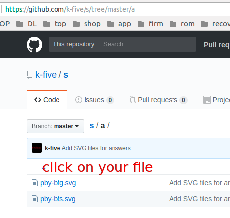
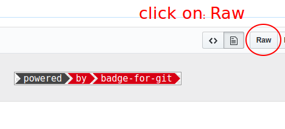
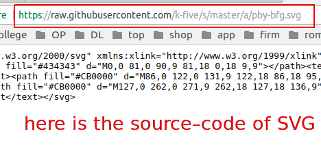
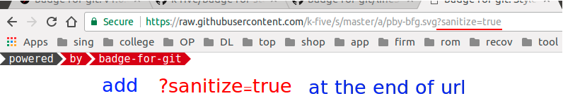

<h1>badge-for-stackoverflow</h1>

<h1>Hi</h1>

During developing my app (= <a href="https://github.com/k-five/badge-for-git" >badge-for-git</a>) I realized that I can use these badges (= SVG files) on <a href="">my stack-overflow profile></a>  
So here is a guide for you that you can use it as well.  

<h3>We you need:</h3>  

 1. an account on **github.com** (for storing the SVG files)  
 2. create a repository (short name is preferable, mine is <a href="https://github.com/k-five/s">s</a>)  
 3. use <a href="https://github.com/k-five/badge-for-git" >badge-for-git</a> and create what you want  
 4. follow the instructions I putted there (= step 1 through 6)  
 5. the follow the below steps  

<h3>step.1 click on your own SVG-file</h3>  

<h3>step.2 click on "Row" button</h3>

<h3>step.3 see the source-code and notice to the "url"</h3>

It consists of:  

 1. `https://`  
 2. `raw.`
 3. `github` and `user` and `content` and `.com`  
 4. your user-name, mine is `k-five`  
 5. your repository name, mine is `s`  
 6. branch, mine is `master`  
 7. directory name, mine is `a`
 8. name of the SVG file, mine is `bpy-bfg.svg`

<h3>step.4 </h3>

 1. this: `?sanitize=true`
 2. press 'Enter'
 3. if want to see a clean source-code, right-click add see: "view-source-page" (optional)

<h3>step.5 </h3>

 - go on your **stack-overflow** account on anywhere you like use an `img` HTML tag or use stack-overflow shortcut: ``

<h3>Example 1. img tag</h3>

for me:  ``

<h3>Example 2. shortcut</h3>

for me:  ``  

